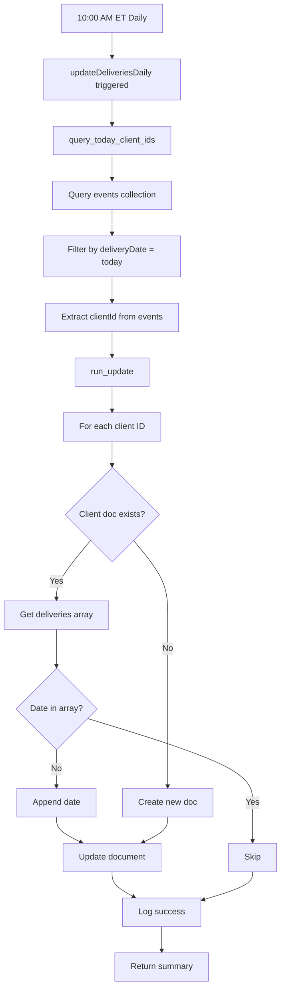

## Overview

The `updateDeliveriesDaily` scheduled function runs automatically every day at 10:00 AM Eastern Time to update client delivery records. It queries today's delivery events and adds the current date to each client's delivery history in Firestore.

## Schedule

```
every day 10:00
```

**Timezone:** America/New_York (Eastern Time)  
**Region:** `us-central1`  
**Memory:** 512 MB  
**Timeout:** 300 seconds

## Function Type

This is a **scheduled Cloud Function** (cron job) that runs automatically. It cannot be called directly via HTTP or as a callable function.

## What It Does

1. **Queries today's delivery events** - Finds all events in the `/events` collection where `deliveryDate` matches today's date (in Eastern Time)
2. **Extracts client IDs** - Gets the `clientId` from each event
3. **Updates client records** - For each client, appends today's date to their `deliveries` array in `/clients/{clientId}`
4. **Creates missing clients** - If a client document doesn't exist, creates it with today's date
5. **Logs summary** - Outputs execution summary to Cloud Logging

## Implementation Details

**Source:** `functions-python/main.py:236`

### Core Logic

The function consists of two helper functions and the scheduled task:

#### `query_today_client_ids(tz_name="America/New_York")`

**Source:** `functions-python/main.py:154`

Queries Firestore for today's delivery events and returns client IDs.

**Returns:**
```python
{
  "success": True,
  "delivery_date": "2026-03-03",
  "event_count": 15,
  "client_ids": ["client1", "client2", "client1", ...],
  "unique_client_count": 8
}
```

**Logic:**
1. Gets current date in Eastern Time
2. Calculates start of day (00:00:00) and end of day (23:59:59) in UTC
3. Queries `/events` collection:
   ```python
   events.where('deliveryDate', '>=', start_utc)
        .where('deliveryDate', '<', end_utc)
   ```
4. Extracts `clientId` from each event document
5. Returns summary with event count and client IDs

#### `run_update(tz_name="America/New_York")`

**Source:** `functions-python/main.py:193`

Performs the actual Firestore updates.

**Returns:**
```python
{
  "success": True,
  "date": "2026-03-03",
  "total_clients": 15,
  "updated_clients": ["client1", "client2", ...],
  "updated_count": 8
}
```

**Logic:**
1. Calls `query_today_client_ids()` to get client IDs
2. For each client ID:
   - Reads `/clients/{clientId}` document
   - If document exists:
     - Gets existing `deliveries` array
     - Appends today's date if not already present
     - Updates document: `doc.update({'deliveries': deliveries})`
   - If document doesn't exist:
     - Creates new document: `doc.set({'deliveries': [current_date]})`
   - Adds to `updated_clients` list
3. Logs errors for individual clients but continues processing
4. Returns summary of total clients processed and updated

## Firestore Schema

### Events Collection

**Path:** `/events/{eventId}`

**Relevant fields:**
```typescript
{
  deliveryDate: Timestamp,  // Date of delivery (Firestore timestamp)
  clientId: string,         // Reference to client ID
  // ... other fields
}
```

### Clients Collection

**Path:** `/clients/{clientId}`

**Updated field:**
```typescript
{
  deliveries: string[],  // Array of delivery dates in "YYYY-MM-DD" format
  // ... other fields
}
```

**Example:**
```json
{
  "deliveries": [
    "2026-03-01",
    "2026-03-03",
    "2026-03-05"
  ]
}
```

## Execution Flow



## Logs and Monitoring

The function outputs detailed logs to Cloud Logging:

### Success Log Example

```json
{
  "severity": "INFO",
  "message": "UPDATING USER DELIVERIES",
  "timestamp": "2026-03-03T15:00:00Z"
}
```

```json
{
  "severity": "INFO",
  "message": "updateDeliveries summary: {\"success\": true, \"date\": \"2026-03-03\", \"total_clients\": 15, \"updated_clients\": [\"client1\", \"client2\"], \"updated_count\": 8}",
  "timestamp": "2026-03-03T15:00:05Z"
}
```

### Error Log Example

```json
{
  "severity": "ERROR",
  "message": "Error processing client client123: [Firestore error details]",
  "timestamp": "2026-03-03T15:00:03Z"
}
```

```json
{
  "severity": "ERROR",
  "message": "updateDeliveriesDaily error: [exception details]",
  "timestamp": "2026-03-03T15:00:10Z"
}
```

## Viewing Logs

View function logs using the Firebase CLI:

```bash
# View all function logs
firebase functions:log

# View logs for specific function
firebase functions:log --only updateDeliveriesDaily

# View recent logs (last 10 minutes)
firebase functions:log --only updateDeliveriesDaily --lines 50
```

Or view in Google Cloud Console:
1. Navigate to Cloud Functions
2. Click on `updateDeliveriesDaily`
3. Click "Logs" tab

## Error Handling

- **Individual client errors:** If updating a single client fails, the error is logged but processing continues for remaining clients
- **Function-level errors:** If the entire function fails, the error is logged and the execution is marked as failed
- **Retry behavior:** Cloud Scheduler automatically retries failed executions based on configuration

## Testing Locally

You cannot trigger scheduled functions directly, but you can test the core logic:

```python
from main import run_update

# Test the update logic
result = run_update("America/New_York")
print(result)
```

Or create a temporary HTTP function wrapper:

```python
@https_fn.on_request()
def test_update_deliveries(req: https_fn.Request):
    """Temporary test endpoint - remove before deploying to production."""
    result = run_update("America/New_York")
    return https_fn.Response(json.dumps(result), status=200, content_type="application/json")
```

## Manual Execution

To manually trigger the function (useful for testing or recovering from failures):

### Using Google Cloud Console

1. Navigate to Cloud Scheduler in Google Cloud Console
2. Find the job for `updateDeliveriesDaily`
3. Click "Force Run"

### Using gcloud CLI

```bash
gcloud scheduler jobs run updateDeliveriesDaily --location=us-central1
```

## Deployment

The function is deployed automatically with:

```bash
firebase deploy --only functions:updateDeliveriesDaily
```

Or deploy all functions:

```bash
firebase deploy --only functions
```

## Configuration

Schedule configuration in `main.py:236`:

```python
@scheduler_fn.on_schedule(
    schedule="every day 10:00",  # Runs at 10:00 AM ET
    region="us-central1",
    memory=512,
    timeout_sec=300,
)
```

### Modifying the Schedule

To change when the function runs, update the `schedule` parameter:

```python
# Every day at 8:00 AM
schedule="every day 08:00"

# Every Monday at 9:00 AM
schedule="every monday 09:00"

# Every 6 hours
schedule="every 6 hours"

# Using cron syntax (minute hour day month weekday)
schedule="0 10 * * *"  # 10:00 AM daily
```

After changing the schedule, redeploy:

```bash
firebase deploy --only functions:updateDeliveriesDaily
```

## Performance Considerations

- **Batch operations:** The function processes clients sequentially. For very large numbers of clients (>1000), consider implementing batch writes
- **Timeout:** Current timeout is 300 seconds (5 minutes). Adjust if processing takes longer
- **Memory:** Allocated 512 MB. Monitor actual usage and adjust if needed

## Monitoring Metrics

Key metrics to monitor:
- **Execution count:** Should run once per day
- **Execution time:** Track how long updates take
- **Error rate:** Monitor failed executions
- **Updated clients count:** Compare with expected delivery count

## Best Practices

<Tip>
  Monitor the function logs regularly to ensure deliveries are being tracked correctly.
</Tip>

- Review logs weekly to check for errors
- Set up Cloud Monitoring alerts for function failures
- Verify `updated_count` matches expected delivery volume
- Test schedule changes in a staging environment first
- Keep the function idempotent (safe to run multiple times for same day)

## Troubleshooting

### Function not running

**Check:**
1. Cloud Scheduler job exists and is enabled
2. Function is deployed: `firebase functions:list`
3. Service account has necessary permissions

### No clients updated

**Check:**
1. Events exist with today's `deliveryDate`
2. Events have valid `clientId` fields
3. Timezone is correct (America/New_York)
4. Firestore permissions allow writes to `/clients` collection

### Partial updates

**Check:**
1. Review logs for individual client errors
2. Verify client documents aren't locked or corrupted
3. Check Firestore quotas and limits